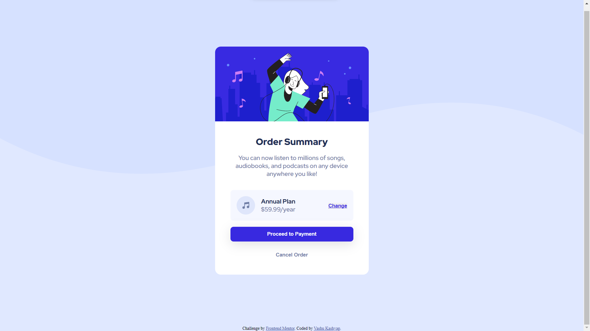

# Frontend Mentor - Order summary card solution

This is a solution to the [Order summary card challenge on Frontend Mentor](https://www.frontendmentor.io/challenges/order-summary-component-QlPmajDUj). Frontend Mentor challenges help you improve your coding skills by building realistic projects. 

## Table of contents

- [Overview](#overview)
  - [The challenge](#the-challenge)
  - [Screenshot](#screenshot)
  - [Links](#links)
- [My process](#my-process)
  - [Built with](#built-with)
  - [What I learned](#what-i-learned)
  - [Useful resources](#useful-resources)
- [Author](#author)

## Overview

### The challenge

Users should be able to:

- See hover states for interactive elements

### Screenshot

### Links

- Solution URL: 
- Live Site URL: 

## My process

### Built with

- Semantic HTML5 markup
- CSS custom properties
- Flexbox
- Mobile-first workflow

### What I learned

In the order summary project, I learned how to effectively utilize HTML5 semantic elements to structure and organize the content of the webpage. Semantic elements such as     and <footer> helped me improve the accessibility and readability of the webpage.

Additionally, I explored the concept of CSS custom properties, also known as CSS variables, which allowed me to define reusable values and easily apply them across different elements. By utilizing custom properties, I could efficiently manage and update styles throughout the project, providing consistency and flexibility.

Furthermore, I implemented flexbox, a powerful CSS layout model, to create a responsive and dynamic design. Flexbox enabled me to efficiently distribute and align elements within containers, resulting in a visually appealing and adaptive layout.

Overall, this project provided valuable hands-on experience with HTML5 semantic elements, CSS custom properties, and flexbox. These skills are fundamental for building well-structured, customizable, and responsive webpages.

## Author

- Linkedin - [im.vashukashyap](https://www.linkedin.com/in/im-vashukashyap/)
- Frontend Mentor - [vashu-kashyap](https://www.frontendmentor.io/profile/vashu-kashyap)
- Instagram - [@im.vashukashyap](https://www.instagram.com/im.vashukashyap/)

